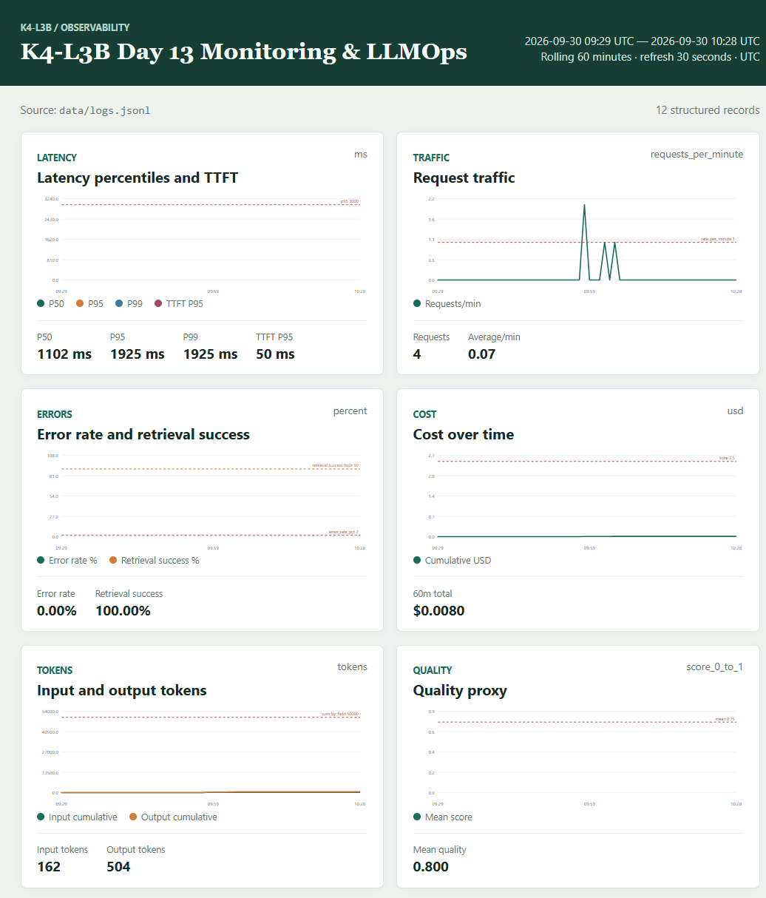

# Báo cáo cá nhân — K4-L3B Day 13 Monitoring & LLMOps

> Mỗi học viên hoàn thiện một file duy nhất này. Khi dẫn evidence, dùng đường dẫn tương đối, ví dụ `evidence/07-trace-waterfall.png`.

## 1. Thông tin học viên

- **Họ và tên** Ngô Thế Việt
- **MSSV** 02594
- **Lớp:** K4-L3B
- **Repository URL:** https://github.com/TheViet298/-K4-L3-DAY13-NgoTheViet-2A202602594-Monitoring-LLMOps.git
- **Commit SHA cuối:**
- **Challenge ID:** `day13-k4-l3b-monitoring-llmops-v1`
- **Tên project Langfuse cá nhân:** `day13-k4-l3b-02594`

## 2. Tiến độ theo checkpoint

| Checkpoint | Yêu cầu chính | Trạng thái và kết quả đã kiểm chứng | Còn thiếu |
|---|---|---|---|
| CP0 | Setup, API, baseline validators, tests | API/load test đã chạy. Baseline ban đầu có log thiếu trường bắt buộc/enrichment; project cá nhân hiện được xác nhận là `day13-k4-l3b-02594`. | Baseline score/output gốc không còn để trích chính xác. |
| CP1 | Correlation ID, enrichment, PII | Hoàn thành. Log validator hiện tại 100/100; 79 records, 34 correlation IDs, 0 thiếu trường/context, 0 PII leak. | Không còn mục CP1 ngoài bộ ảnh đã lưu. |
| CP2 | Metrics, >=10 traces, child spans, prompt v1/v2/rollback, dashboard, SLO/alerts | Đã xác minh 25 root traces; prompt v1/v2 và luồng baseline → candidate → promote production v2 → rollback production v1 đều có trace Langfuse; dashboard runtime 6 panel có dữ liệu; 3 alert/runbook đã hoàn thiện. | Chụp ảnh Langfuse metadata, Prompts và promote/rollback trong phiên đăng nhập cá nhân; xác nhận Slack channel thực tế. |
| CP3 | Challenge chính thức, metric -> log -> trace -> root cause | Hoàn thành điều tra challenge ID nêu trên; xác định retrieval span chậm và đã tắt incident sau khi thu thập. Logs CP3 ghi Langfuse 404 vì prompt production chưa được tạo lúc chạy; fallback khi đó là `local-v1`. | Chụp evidence metric/dashboard, log và trace trong project cá nhân. |
| CP4 | Report, evidence, final checks, commit | Report được điền bằng kết quả đã xác minh; tests và validators chạy xanh. | Thêm các ảnh còn thiếu, điền thông tin cá nhân/repo/commit, kiểm tra secret, commit và nộp. |

## 3. Evidence index

Các output text có thật được lưu trong thư mục evidence. Các ảnh ghi `Chưa có` chưa được tạo; không xem đây là evidence đã nộp.

| Evidence | Đường dẫn/trạng thái |
|---|---|
| Pytest cuối | `evidence/01-pytest.txt` |
| Log validator | `evidence/02-log-validator.txt` |
| Dashboard validator | `evidence/03-dashboard-validator.txt` |
| CP2 prompt trace IDs | `evidence/cp2-prompt-traces.txt` |
| CP2 dashboard runtime data | `evidence/cp2-dashboard-runtime.txt` |
| CP3 Langfuse prompt fallback | `evidence/cp3-prompt-fallback.txt` |
| Structured log | `evidence/04-structured-log.png` |
| PII redaction | `evidence/05-pii-redaction.png` |
| Trace list | `evidence/06-trace-list.png` |
| Trace waterfall | `evidence/07-trace-waterfall.png` |
| Trace metadata | Chưa có ảnh Langfuse: `evidence/08a-trace-metadata.png`, `evidence/08b-generation-metadata.png` |
| Prompt versions | Prompt v1/v2 đã xác minh; ảnh UI còn thiếu: `evidence/09-prompt-versions.png` |
| Prompt rollback | Promote/rollback đã xác minh bằng trace; ảnh trạng thái trước/sau còn thiếu: `evidence/10a-prompt-promote.png`, `evidence/10b-prompt-rollback.png` |
| Dashboard runtime | 6 panel có dữ liệu; [ảnh runtime](evidence/11-dashboard-overview.png) |
| Incident metric | Chưa có ảnh: `evidence/12-incident-metric.png` |
| Incident log | Chưa có ảnh: `evidence/13-incident-log.png` |
| Incident trace | Chưa có ảnh: `evidence/14-incident-trace.png` |

## 4. Kết quả kỹ thuật

| Nội dung | Baseline | Kết quả cuối | Nhận xét |
|---|---|---|---|
| `validate_logs.py` | Baseline thiếu trường/enrichment; score gốc không còn | 100/100 | 79 records, 34 correlation IDs, 0 PII leak |
| `validate_dashboard.py` | Kết quả baseline không còn | 6/6 | Contract hợp lệ; runtime dashboard lấy dữ liệu trực tiếp từ log |
| `pytest` | Kết quả baseline không còn | 25 passed | Chạy ngày 2026-09-30; lần kiểm tra trước commit: 5.81s |
| Số traces hợp lệ | Chưa thống kê baseline | 25 root traces đã xác minh | Có cây root/retrieval/generation; project `day13-k4-l3b-02594` |
| Số PII leak | Không còn số baseline | 0 | Theo log validator hiện tại |
| Latency P95 / TTFT P95 | Chưa lưu baseline | CP3: 3394 ms / 50 ms | 5 challenge requests; ngưỡng challenge 2000 ms |
| Retrieval success rate | Chưa lưu baseline | CP3: 100% (5/5) | Các request challenge trả HTTP 200 và log `tool_success=true` |

## 5. Logging và PII

- **Cách tạo/nhận và truyền correlation ID:** middleware chấp nhận `x-request-id` đúng định dạng `req-<8-hex>`, nếu không thì sinh ID mới; xóa context cũ, bind ID và trả lại trong response header.
- **Các metadata được ghi vào structured log:** `user_id_hash`, `session_id`, `feature`, `model`, `env`, cùng timestamp, level, event và các metric request.
- **Cách bảo đảm PII được scrub trước khi ghi:** `scrub_event` chạy trước JSON renderer và file writer; log chỉ lưu preview đã sanitize và hash user ID.
- **Cách kiểm chứng:** `python scripts/validate_logs.py`: 79 records, không thiếu trường/enrichment, 34 correlation IDs, 0 PII leak; xem [output validator](evidence/02-log-validator.txt).

## 6. Tracing và prompt versioning

- **Cách xác nhận traces do chính tôi tạo trong project cá nhân:** 25 root observations được truy vấn bằng credentials cục bộ trong `.env`; project hiển thị là `day13-k4-l3b-02594`.
- **Cấu trúc root/retrieval/generation observations:** root `lab-agent-run` có hai child observations `retrieval` và `llm-generation`.
- **Cách nối trace với log:** metadata `correlation_id` giống nhau trên structured log và root/child observations.
- **Prompt name:** trace CP3 ghi `day13-chat`.
- **Prompt tại thời điểm CP3:** log lúc `2026-09-30T05:03Z` ghi HTTP 404 cho label `production`, vì prompt chưa tồn tại khi challenge chạy; trace CP3 dùng `local-fallback/local-v1`. Prompt đã được tạo sau đó và các trace CP2 baseline/candidate/promote/rollback bên dưới xác nhận `prompt_source=langfuse`.
- **Version/label baseline:** text prompt `day13-chat` v1 có đủ ba biến và labels `baseline`/`production`. Trace dùng baseline: `e48b7e94c1088a373b8e8c768fd66319`, correlation ID `req-a4144c2b`.
- **Version/label candidate:** v2 thêm hướng dẫn trả lời ngắn gọn, label `candidate`. Trace dùng candidate: `bfeca807bba8c18f7af321f6b761a323`, correlation ID `req-1615d18f`.
- **Trace ID của mỗi version:** v1 `e48b7e94c1088a373b8e8c768fd66319`; v2 `bfeca807bba8c18f7af321f6b761a323`. Cùng một input; metadata cho thấy `prompt_source=langfuse`, label/version khớp.
- **Cách promote và rollback `production`:** promote production sang v2, request trace `1e253a0128e308c4db62bbe9875a2752` (`req-e2706bce`), metadata `production`/v2; rollback production về v1, trace `59e5bedb57f5b5e7199febf07d3bf23d` (`req-abf90371`), metadata `production`/v1. Pointer Langfuse cuối cùng đã xác nhận production→v1.
- **Generation metadata và privacy:** generation ghi model, usage input/output tokens và cost; các root/retrieval/generation traces mới có input/output rỗng. Regression test xác nhận không gửi các trường raw này.

## 7. Dashboard, SLO và alerts

- **Dashboard và sáu panel:** [scripts/dashboard.py](../scripts/dashboard.py) đọc `data/logs.jsonl`, cửa sổ 60 phút, refresh 30 giây, gồm Latency, Traffic, Errors/retrieval success, Cost, Tokens, Quality và threshold. Runtime snapshot có 12 records: P95 1925 ms, TTFT P95 50 ms, error 0%, retrieval success 100%, cost $0.0080, input/output 162/504 tokens, quality 0.800. Ảnh: [dashboard runtime](evidence/11-dashboard-overview.png).
- **SLO và lý do chọn:** `fast_successful_requests`, mục tiêu 99.5% trong 28 ngày; request tốt là `response_sent` với latency <= 3000 ms.
- **Cách tính error budget:** 100% - 99.5% = 0.5%; với 10,000 request, tối đa 50 request không đạt SLO.
- **Ba alert và runbook tương ứng:** `HighLatencyP95` (P95 > 3000 ms trong 5m), `ElevatedRequestErrorRate` (error rate > 2% trong 5m), `LowRetrievalSuccess` (retrieval success < 90% trong 5m); owner `student-02594`, Slack `#k4-l3b-alerts`, runbooks tại `docs/alerts.md` với heading đúng `## Alert 1/2/3`. Cần xác nhận Slack channel thực tế.

## 8. Điều tra challenge

- **Challenge ID:** `day13-k4-l3b-monitoring-llmops-v1`.
- **Khoảng thời gian điều tra:** 2026-09-30 05:02:57–05:03:12 UTC.
- **Triệu chứng từ metrics:** 5 requests; latency P50 2887 ms, P95/P99 3394 ms, TTFT P95 50 ms, 0 errors. P95 vượt threshold challenge 2000 ms.
- **Log line và correlation ID liên quan:** `response_sent` lúc `2026-09-30T05:03:06.874861Z`, `correlation_id=req-74141e13`, `latency_ms=2887`, `tool_name=retrieval`, `tool_success=true`.
- **Trace ID và span gây ảnh hưởng:** trace `dddd18ba9388b7bfc32115f443f383d3`; root observation `lab-agent-run` mất 2891 ms; child `retrieval` (`643226d6bead350f`) mất 2505 ms; child `llm-generation` mất 155 ms. Cùng correlation ID `req-74141e13`.
- **Root cause:** challenge bật `rag_slow`; [app/mock_rag.py](../app/mock_rag.py) chờ 2.5 giây trong retrieval. Trace duration và latency logs phù hợp với injected delay; generation không phải bottleneck.
- **Fix action:** sau khi lưu evidence, đã tắt injected incident. Không xóa delay trong mock vì đây là fault injector của challenge. Với hệ thống thật, tối ưu/đặt timeout cho retrieval và rollback thay đổi retrieval nếu trace xác nhận.
- **Preventive measure:** giữ alert P95 và runbook Metrics → Logs → Traces; thêm kiểm thử latency budget cho retrieval và theo dõi duration của retrieval span.

> Gợi ý cách viết ngắn, không thay cho evidence thực tế: "Metric cho thấy `[latency/error/cost/quality]` bất thường trong `[khoảng thời gian]`. Log line `[event]` có `correlation_id=[...]` đại diện cho request bị ảnh hưởng. Trace cùng `correlation_id` cho thấy span `[retrieval/generation/prompt/tool]` có dấu hiệu `[chậm/lỗi/token tăng]`. Root cause là `[nguyên nhân suy ra từ evidence]`. Fix action là `[hành động khôi phục]`; preventive measure là `[alert/runbook/test/guardrail để ngăn tái diễn]`."

## 9. Giải thích và tự đánh giá

- **Một quyết định kỹ thuật quan trọng và lý do:** dùng một correlation ID xuyên logs và trace metadata để thu hẹp từ metric bất thường tới request và span cụ thể.
- **Một lỗi/blocker đã gặp:** port 8000 bị tiến trình cũ chiếm; lần khởi động không nạp `.env` khiến tracing tắt.
- **Cách tìm nguyên nhân và xử lý:** kiểm tra health/port, dừng tiến trình cũ, khởi chạy Uvicorn với `--env-file .env`; xác nhận tracing bật trước khi chạy challenge.
- **Cách hiểu luồng Metrics → Logs → Traces:** metrics khoanh vùng latency bất thường; log chọn `correlation_id`; trace cùng ID cho thấy retrieval span chiếm thời gian.
- **Vai trò của prompt version, token/cost, SLO hoặc rollback trong vận hành LLM:** version trace cho biết request dùng prompt nào; token/cost theo dõi mức sử dụng; SLO/error budget định lượng độ tin cậy; rollback đưa production về v1 sau khi kiểm tra candidate.
- **Điều quan trọng nhất đã học:** không kết luận từ latency tổng; so sánh span trong trace với log và metric để chứng minh nguyên nhân.
- **Hạn chế hoặc phần chưa hoàn thành, nếu có:** baseline score gốc không còn; ảnh UI Langfuse/trace/prompt và CP3 incident screenshots còn thiếu; Slack channel cần xác nhận; commit SHA cuối chưa ghi.

## 10. Checklist trước khi nộp

- [ ] Kết quả và evidence thuộc commit SHA cuối; SHA cuối chưa ghi.
- [ ] Tất cả ảnh/output mở được bằng đường dẫn tương đối; ảnh 04–07, 11 và output text đã có; Langfuse metadata/prompt và incident screenshots còn thiếu.
- [x] Chuỗi incident metric → log → trace đã đối chiếu bằng correlation ID.
- [ ] Trace/prompt screenshots thuộc project Langfuse cá nhân, không lộ key/secret.
- [ ] Repository chạy lại được theo README trên môi trường sạch.
- [ ] Secret/PII scan cuối chưa chạy; challenge file vẫn nằm trong `.gitignore`.
- [ ] URL repo và commit SHA cuối đã được nộp trên LMS/Codelabs.
